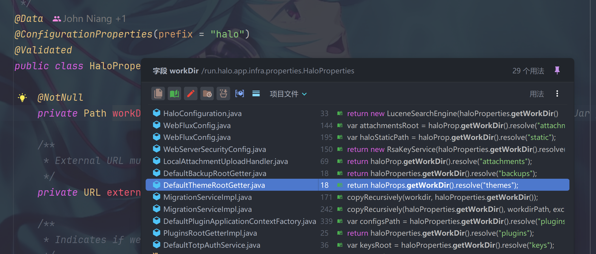

## 使用helm部署的，导入导入总是报错
导入报错：halo-2.18
报错日志：
```text
2024-08-10T13:20:37.101+08:00 ERROR 7 --- [undedElastic-26] a.w.r.e.AbstractErrorWebExceptionHandler : [d05ce103-14186]  500 Server Error for HTTP POST "/apis/api.plugin.halo.run/v1alpha1/plugins/export2doc/doImport/import"
2024-08-10T13:20:37.104971076+08:00
2024-08-10T13:20:37.104977772+08:00 java.nio.file.NoSuchFileException: /.halo2/plugins/export2doc_files/import/README.md
at java.base/sun.nio.fs.UnixException.translateToIOException(Unknown Source) ~[na:na]
2024-08-10T13:20:37.104986647+08:00 	Suppressed: reactor.core.publisher.FluxOnAssembly$OnAssemblyException:
Error has been observed at the following site(s):
2024-08-10T13:20:37.104997452+08:00 	*__checkpoint ⇢ Handler cn.lyn4ever.export2md.rest.ImportController#importPost(Flux) [DispatcherHandler]
2024-08-10T13:20:37.105013477+08:00 	*__checkpoint ⇢ run.halo.app.security.InitializeRedirectionWebFilter [DefaultWebFilterChain]
*__checkpoint ⇢ run.halo.app.security.device.DeviceSessionFilter [DefaultWebFilterChain]
*__checkpoint ⇢ run.halo.cache.page.PageCacheWebFilter [DefaultWebFilterChain]
2024-08-10T13:20:37.105066160+08:00 	*__checkpoint ⇢ SecurityWebFilterChainProxy [DefaultWebFilterChain]
*__checkpoint ⇢ AuthorizationWebFilter [DefaultWebFilterChain]
2024-08-10T13:20:37.105074336+08:00 	*__checkpoint ⇢ ExceptionTranslationWebFilter [DefaultWebFilterChain]
*__checkpoint ⇢ LogoutWebFilter [DefaultWebFilterChain]
*__checkpoint ⇢ ServerRequestCacheWebFilter [DefaultWebFilterChain]
2024-08-10T13:20:37.105088022+08:00 	*__checkpoint ⇢ SecurityContextServerWebExchangeWebFilter [DefaultWebFilterChain]
*__checkpoint ⇢ LogoutPageGeneratingWebFilter [DefaultWebFilterChain]
*__checkpoint ⇢ AnonymousAuthenticationWebFilter [DefaultWebFilterChain]
*__checkpoint ⇢ SecurityWebFilterChainProxy [DefaultWebFilterChain]
*__checkpoint ⇢ TotpAuthenticationFilter [DefaultWebFilterChain]
2024-08-10T13:20:37.105115406+08:00 	*__checkpoint ⇢ AuthenticationWebFilter [DefaultWebFilterChain]
*__checkpoint ⇢ SecurityWebFilterChainProxy [DefaultWebFilterChain]
2024-08-10T13:20:37.105125781+08:00 	*__checkpoint ⇢ AuthenticationWebFilter [DefaultWebFilterChain]
*__checkpoint ⇢ SecurityWebFilterChainProxy [DefaultWebFilterChain]
2024-08-10T13:20:37.105133720+08:00 	*__checkpoint ⇢ AuthenticationWebFilter [DefaultWebFilterChain]
*__checkpoint ⇢ AuthenticationWebFilter [DefaultWebFilterChain]
2024-08-10T13:20:37.105141596+08:00 	*__checkpoint ⇢ ReactorContextWebFilter [DefaultWebFilterChain]
*__checkpoint ⇢ CsrfWebFilter [DefaultWebFilterChain]
*__checkpoint ⇢ CorsWebFilter [DefaultWebFilterChain]
*__checkpoint ⇢ HttpHeaderWriterWebFilter [DefaultWebFilterChain]
2024-08-10T13:20:37.105157388+08:00 	*__checkpoint ⇢ SecurityWebFilterChainProxy [DefaultWebFilterChain]
2024-08-10T13:20:37.105161350+08:00 	*__checkpoint ⇢ ServerWebExchangeReactorContextWebFilter [DefaultWebFilterChain]
*__checkpoint ⇢ org.springframework.security.web.server.WebFilterChainProxy [DefaultWebFilterChain]
*__checkpoint ⇢ run.halo.comment.widget.captcha.CommentCaptchaFilter [DefaultWebFilterChain]
2024-08-10T13:20:37.105187146+08:00 	*__checkpoint ⇢ cc.ryanc.staticpages.endpoint.RewriteOnNotFoundFilter [DefaultWebFilterChain]
*__checkpoint ⇢ run.halo.app.webfilter.AdditionalWebFilterChainProxy [DefaultWebFilterChain]
2024-08-10T13:20:37.105197742+08:00 	*__checkpoint ⇢ HTTP POST "/apis/api.plugin.halo.run/v1alpha1/plugins/export2doc/doImport/import" [ExceptionHandlingWebHandler]
Original Stack Trace:
2024-08-10T13:20:37.105208065+08:00 		at java.base/sun.nio.fs.UnixException.translateToIOException(Unknown Source) ~[na:na]
at java.base/sun.nio.fs.UnixException.rethrowAsIOException(Unknown Source) ~[na:na]
2024-08-10T13:20:37.105224398+08:00 		at java.base/sun.nio.fs.UnixException.rethrowAsIOException(Unknown Source) ~[na:na]
at java.base/sun.nio.fs.UnixFileSystemProvider.newAsynchronousFileChannel(Unknown Source) ~[na:na]
at java.base/java.nio.channels.AsynchronousFileChannel.open(Unknown Source) ~[na:na]
2024-08-10T13:20:37.105240547+08:00 		at org.springframework.core.io.buffer.DataBufferUtils.lambda$write$11(DataBufferUtils.java:369) ~[spring-core-6.1.10.jar:6.1.10]
at reactor.core.publisher.MonoCreate.subscribe(MonoCreate.java:61) ~[reactor-core-3.6.7.jar:3.6.7]
at reactor.core.publisher.Mono.subscribe(Mono.java:4568) ~[reactor-core-3.6.7.jar:3.6.7]
at reactor.core.publisher.Mono.block(Mono.java:1778) ~[reactor-core-3.6.7.jar:3.6.7]
at cn.lyn4ever.export2md.rest.ImportController.lambda$importPost$2(ImportController.java:86) ~[na:na]
at reactor.core.publisher.FluxFlatMap$FlatMapMain.onNext(FluxFlatMap.java:388) ~[reactor-core-3.6.7.jar:3.6.7]
at reactor.core.publisher.FluxPublishOn$PublishOnSubscriber.runAsync(FluxPublishOn.java:446) ~[reactor-core-3.6.7.jar:3.6.7]
at reactor.core.publisher.FluxPublishOn$PublishOnSubscriber.run(FluxPublishOn.java:533) ~[reactor-core-3.6.7.jar:3.6.7]
2024-08-10T13:20:37.105349295+08:00 		at reactor.core.scheduler.WorkerTask.call(WorkerTask.java:84) ~[reactor-core-3.6.7.jar:3.6.7]
at reactor.core.scheduler.WorkerTask.call(WorkerTask.java:37) ~[reactor-core-3.6.7.jar:3.6.7]
2024-08-10T13:20:37.105359852+08:00 		at java.base/java.util.concurrent.FutureTask.run(Unknown Source) ~[na:na]
2024-08-10T13:20:37.105365531+08:00 		at java.base/java.util.concurrent.ScheduledThreadPoolExecutor$ScheduledFutureTask.run(Unknown Source) ~[na:na]
2024-08-10T13:20:37.105370435+08:00 		at java.base/java.util.concurrent.ThreadPoolExecutor.runWorker(Unknown Source) ~[na:na]
2024-08-10T13:20:37.105375088+08:00 		at java.base/java.util.concurrent.ThreadPoolExecutor$Worker.run(Unknown Source) ~[na:na]
at java.base/java.lang.Thread.run(Unknown Source) ~[na:na]
```

分析下来是路径问题，找不到文件，需要检查一下路径是否正确。拉取源码查看问题

## 源码本地启动
本地按照插件方式运行启动后，一切正常，推测是版本问题。仔细查看报错信息，发现路径和我实际部署的路径不一致。实际部署制定了`halo.work-dir`属性，在k8s中为`HALO_WORK_DIR`环境变量。

检查路径：
```java

    private static final String  ROOT_PATH="/.halo2/plugins/export2doc_files";
    public enum DirPath{
        EXPORT,
        IMPORT;
    }

    public static Path getDocFile(DirPath dirPath) {
        String userHome = System.getProperty("user.home");
        Path path = Paths.get(userHome, ROOT_PATH).resolve(dirPath.name().toLowerCase());
        if (!path.toFile().exists()) {
            path.toFile().mkdirs();
        }
        return path;
    }
```
使用的是固定路径。但是容器部署可以指定路径。

## 分析halo源码

分析halo的源码，查看这个 `halo.work-dir`属性，在 PluginsRootGetter 中使用，返回插件路径，其他也是类似，比如日志路径等。

```java
@Component
public class PluginsRootGetterImpl implements PluginsRootGetter {

    private final HaloProperties haloProperties;

    public PluginsRootGetterImpl(HaloProperties haloProperties) {
        this.haloProperties = haloProperties;
    }

    @Override
    @NonNull
    public Path get() {
        return haloProperties.getWorkDir().resolve("plugins");
    }

}
```



正好是在2.18.0提供的方法

## 修改和测试


### gradle环境配置

修改`gradle-wrapper.properties`，修改版本为8.9
然后调整`gradle_home`和`jvm`相关版本，都调整为`17-open`

### 调整build.gradle

在这里查看相关依赖和版本

1. 修改 `run.halo.plugin.devtools` 为 0.1.1
2. 修改 `com.github.node-gradle.node` 为 7.0.2
3. 修改 `run.halo.tools.platform:plugin` 为 2.18.0-SNAPSHOT
4. 修改 `cn.hutool:hutool-all` 为 5.8.25 主要是一个安全漏洞的更新
5. halo 中的version修改为 2.18

### 代码修改

主要是用 `pluginsRootGetter.get().resolve("export2doc_files").resolve(FileUtil.DirPath.EXPORT.name().toLowerCase())` 替换现在的方法，区分一下`IMPORT`和`EXPORT`

后续还是需要继续优化的，先保证本地可用